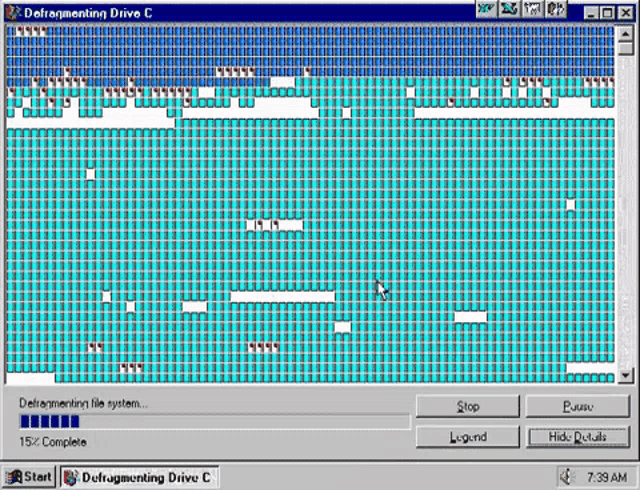

Looking at the picture above I and many others get that warm fuzzy feeling from
childhood memories. The knowledge that over potentially several hours 
windows was laying out data on-disk in perfect order and would leave your
hard-drive in impeccable state was incredibly [satisfying][defrag-reddit].
And while we eventually have to accept that entropy is real and time
is inevitably moving forward, there is a chance we can all relive this
feeling.

The Delta ecosystem is currently undergoing a transformation, a defragmentation of you will,
which aims to address one of the longest standing and in my opinion most annoyinmg issues
that has been plagueing the entire data ecosystem for some decades now - fragmentation.
And the vehicle by which this happens, is the [delta-kernel-rs] library.

Since we are talking about [Delta](delta.io), we'll use it as an example to see how
this affects the community. Column Mapping is a table feature defined in the
[delta protocol][delta-protocol] which enables rich features,  specifically freely renaming columns
and even using names that would not be valid when used directly with a parquet file. It achieves this
by separating logical (what the query engine sees) from physical (what is stored on disk) column names.
Implementing this feature can have a significnat blast radius as it touches all code where
column or field names are referenced. Not all integrations have the bandwidth to implement this feature,
so as a result, some tables can only be read by a subset of engines, which support the relevant feature
making the table illegible to engines which do not support this feature.

We observed the same when Apache Parquet intoduced new encodings or when Apache Iceberg introduces
new format versions. The reason this issue is so pervasive is because it is not as simple to
solve as one might think.

## How Delta-Kernel de-fragments the ecosystem

- C-shaped kernel api

## The Good, The Bad, and the Ugly

- Good: level of abstraction
- Bad: Spawn blocking chokepoint
- Ugly: the resulting code in delta-rs

## How Delta-Kernel actuallty de-fragments the ecosystem

- Plans + State Machine
- recent experience: wasm query engine

[defrag-reddit]: https://www.reddit.com/r/oddlysatisfying/comments/17zrhy6/disk_defragment_on_old_pc_was_incredibly/
[delta-protocol]: https://github.com/delta-io/delta/blob/master/PROTOCOL.md
[delta-kernel-rs]: https://github.com/delta-io/delta-kernel-rs
