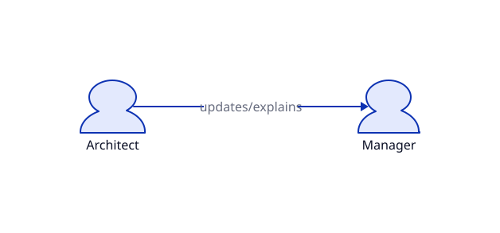
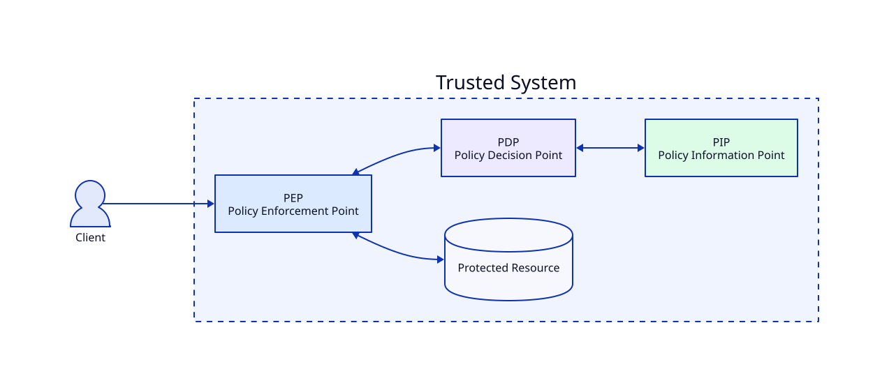
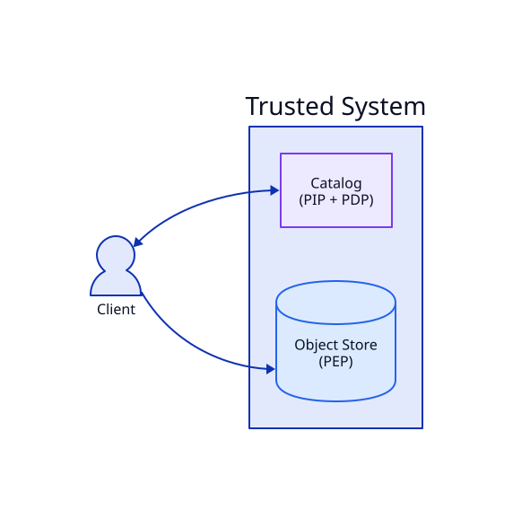
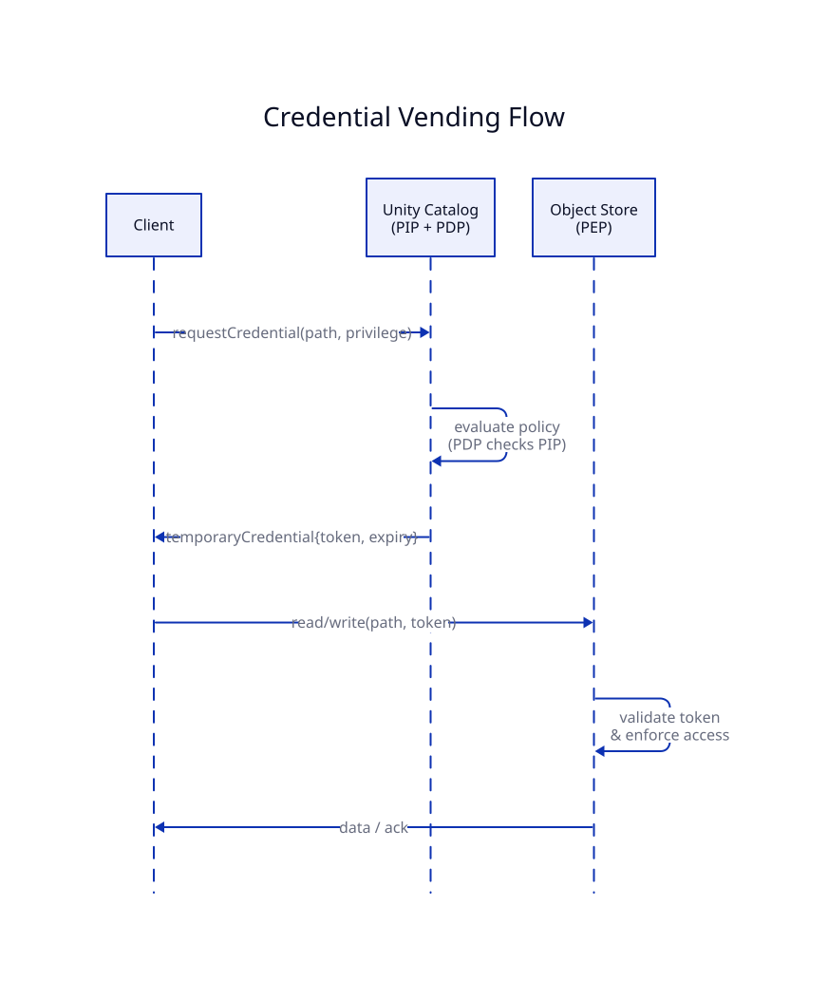
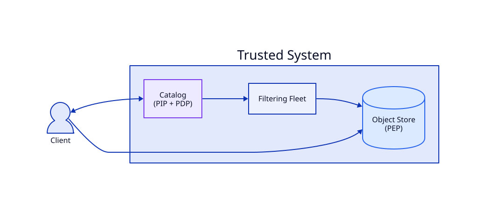
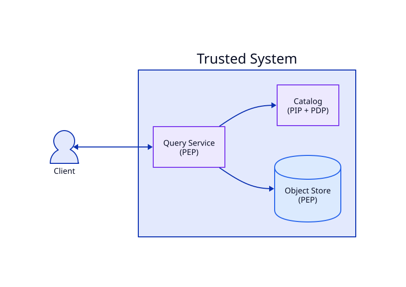

<!--
Imported from Google Doc "Trust in your Open Lakehouse" (tab "Tab 2"), 2026-07-02.
Prose is the author's draft, kept faithful on import. Known rough spots (cut-off
sentences, a typo, the "CDAR" policy-engine name, and the still-open CTA) are
tracked in brief.md §7/§9/§10, not silently edited here.

Diagrams are authored in D2 (assets/*.d2 — the source of truth) and rendered to
assets/*.svg by ../render-diagrams.sh. The Google Doc embedded PNG renders of
these same sources; here we reference the local SVGs. Re-run the render script
after editing any .d2 source.
-->

# Trust in your Lakehouse

A key responsibility of senior architects is communicating with management, which may often be non-technical. One key tool architects love for communication is architectural diagrams. In fact, we can use an architecture diagram to illustrate this situation.

In many ways, this diagram does a great job of describing what is happening or what needs to be done. At first glance, we can see that there are apparently two parties, the Architect and Manager, involved, and that the Architect is providing an update and explanations to the Manager. However, in other, in this case, much more relevant ways, this diagram leaves much to be desired in how the architect conveys the relevant information. This simple diagram conflates most, if not all, of the system's complexity into a single arrow connecting the two actors.

As it turns out, this is a common occurrence in platform architecture diagrams. In my role as the chief architect for the data & AI platforms in a major enterprise, I had management memorize an oversimplified mantra to remember when presented with such diagrams: "boxes are easy, arrows are hard."

So why is this relevant to the Lakehouse and governance within the lakehouse? It's not just because others did all the hard work of actually building the boxes. In the hopes of not overextending the analogy, there are many factors that determine whether this communication will work: where this exchange is taking place, whether the actors trust one another, and whether they share a common vocabulary. The same is happening as a data platform/lakehouse scales. In the early stages of platform development, the thinking is very much centered around the services, the boxes in the diagram, which query engine to choose, which catalog to integrate, and what databases to deploy. Over time, as the platform matures and the stakes rise, you find yourself drawn to the cross-cutting concerns that can enable some of the most valuable use cases: trust, security, governance, reliability, etc.

Realizing that we can greatly simplify each and every user's, developer's, and operator's experience on the platform by hoisting a significant portion of the responsibility for these properties to the platform level was one of the greatest inflection points I ever experienced in my career. In fact, we turned some of the greatest blockers for high-value use cases and the democratization of solution development into a massive accelerator for the adoption of data and AI across the organization.

Naturally, we were by far not the first to have that realization; service meshes, application runtimes, etc., exist for that very reason. So let's dive deeper into how trust, security, and governance are handled across many platforms today, the limitations they face, and how we can hope to address them.

## Governance in today's Lakehouse

Before we go deeper, let's formalize the discussion a bit using more architecture diagrams and establishing a common vocabulary.

A Policy is the codified answer to "who or what is allowed to do what, under which conditions." In a [zero-trust architecture](https://nvlpubs.nist.gov/nistpubs/specialpublications/NIST.SP.800-207.pdf) (highly recommended for critical deployments), there are three main components that enforce policy.

- Policy Information Point (PIP): part of the system that provides metadata for evaluating a policy
- Policy Decision Point (PDP): part of the system that evaluates a policy and provides the result.
- Policy Enforcement Point (PEP): part of the system that enforces the decision made by the PDP

We can now map this to the three most prevalent concepts that power governance in today's lakehouses:

- Credential Vending
- Server-side planning
- Trusted compute

### Credential Vending

Due to its relative simplicity while being surprisingly powerful, credential vending is one of these things that seem obvious and make you wonder why we haven't always done it that way; a central component, the catalog, holds a powerful credential for accessing a downstream service (e.g., storage) and provides down-scoped and short-lived credentials to clients wanting to access that service.

This approach eliminates a host of challenges in secret management and service configuration, especially in multi-user, multi-tenant scenarios. Removing direct user access to storage and embracing credential vending are among the first steps a platform should take to significantly improve its security posture. Trust is extended to the catalog to make the correct policy decision and to the object storage to dutifully enforce access based on the credential.

### Server-side planning

Server-side planning is a pattern that can greatly extend what we can achieve via vended credentials in the lakehouse. Considering the dominant kind of tables in a Lakehouse, these are based on an open table format, credential vending allows us to make a binary, all-or-nothing decision on whether a given client can read the data from a table. Since clients need to discover the entire table layout and have full access to at least all table metadata and statistics, it would be very challenging to hide parts of the table (columns or rows) from client read access.

Enter server-side planning. Rather than asking for a credential to read the table, the client asks the catalog to pre-plan a specific query. The catalog then returns a list of files to read, along with a credential to access them. This, by itself, allows controlling access at the file boundary (e.g., enforcing a policy based on a partition value). By granting the catalog access to a trusted query service, we can achieve fine-grained access control at the column and row levels.

When the client hits the scan endpoint, the catalog may forward the query (or parts of it) to a trusted query engine, which writes pruned or resolved results to the storage system. The client then receives vended credentials to the files, which now contain only data the client is allowed to read. Depending on the design, the client may still have to do some work in resolving the actual end user query, but is never exposed to data that it's not allowed to read.

While this approach allows for fine-grained access control, it comes with the additional complexity of maintaining the filtering fleet and additional processing costs. Luckily we can do better.

### Trusted Compute

Trust is a critical concept, and we will be discussing how and why we trust something in a later section of this blog. For now, let's just assume we can trust the engine, which entails multiple things:

- The engine will faithfully execute any policy communicated by the catalog
- The end user cannot access credentials or raw data directly within the environment in which the engine is executing

Trusted compute can be implemented in several ways, the most common being a server-client architecture. However, if one can exert the required controls over any user environment or extend trust to the users to a degree where they will not try and circumvent these constraints in their environment. That is, if operators want guarantees that policies are applied.

One thing to note is that enforcement now occurs across all services. The catalog can still deny a client's request, the storage backend still validates credentials, and the query service applies fine-grained policies such as column masking and row-level security.

Speaking of trusted compute, it is worthwhile to consider how trust is even established. The most established case is to present some form of credential, a certificate, a password, something cryptographically verifiable, in order to establish trust. Anyone in possession of that credential can authenticate and establish trust with our services.

Probably all of us have used biometric authentication on our smartphones or laptops before. This is a step towards a different kind of authentication mechanism. Rather than presenting a credential, we try to learn facts about the subject who wants to perform an action, and issue a credential if these facts match our expectations. This is called identity attestation. For the trusted compute example, we might base our trust on a certificate issued by the cloud provider for the hardware, then ensure that a certain process is associated with a specific namespace in a Kubernetes cluster. And finally, asserting that the hash of the executable being executed within that process corresponds to the hash of the trusted binary that has been verified elsewhere.

When it comes to the principals, we have long been distinguishing between human users and system users. Extending trust to principals is ultimately based on accountability. People are employed and have signed contracts that hold them accountable for their actions, so we trust they're not leaking sensitive information. Systems have thus far been mostly deterministic, and we have trusted the development and review process to provide accountability for them.

With the advent of agents, some of our fundamental trust mechanics are being challenged.

## Governance in the agentic Lakehouse

The hardest version of the governance problem in agentic AI isn't access control at read time. It is what happens after.

Consider a concrete scenario. An agent is tasked with generating a report. To complete the task, it reads a table containing customer PII — a table the catalog correctly classifies as confidential and appropriately controls access to. The catalog has done its job: it enforced the access policy at read time.

But the agent's execution context now contains confidential data. If the agent subsequently calls an external API, invokes a code execution tool, or writes output to a location outside the catalog's purview, that confidential data can propagate — not through a policy violation at the table level, but through the entirely normal operation of the agent completing its task.

This is what information security calls *taint propagation*: sensitive data enters an execution context and must be tracked through every downstream operation that context performs. Preventing leakage requires the ability to conditionally restrict what a tainted execution context can do next — blocking tool calls, limiting output destinations, flagging operations for review.

So how can we assert that an agent that reads sensitive data will not leak this data in a non-compliant manner? Given the current authorization architectures we discussed earlier, it is not even clear to the consuming principal if sensitive data has been read.

Squinting at the problem, we see that this is similar to using lineage information to propagate sensitivity information for individual columns, such as PII. The main difference being that this now needs to extend dynamically into agentic sessions and apply to a much wider range of actions than we're used to in the classical query engine scenario.

In our security architecture, this means policy enforcement must occur across the entire platform at the point where all relevant context is available.

In practice, the catalog likely used a policy engine such as Open Policy Agent, Open FGA, or CDAR in the backend to handle policy decisions. The new thing here is context to inform decision-making about tool usage in our architecture. The catalog simply does not have enough information to make such a decision. The decision to use a certain tool is made after we read the data; however, the agent making that decision cannot be trusted not to process or use it in an unacceptable manner.

We, of course, always had to evaluate policies in some way, shape, or form outside of the catalog; however, the rise of AI agents and the convergence of business and data-heavy applications are forcing us to rethink the catalog-centric model and acknowledge governance and policies as a platform-level responsibility, which means:

- Runtime enforcement across the full execution lifecycle
- Context/session-aware policy evaluation
- A control plane that spans data and compute

<!-- TODO: Call to action — still open. Point at the Iceberg REST Catalog tags/labels
proposal (per author + reviewer), or keep generic and tee up the follow-on posts.
See brief.md §7. -->
