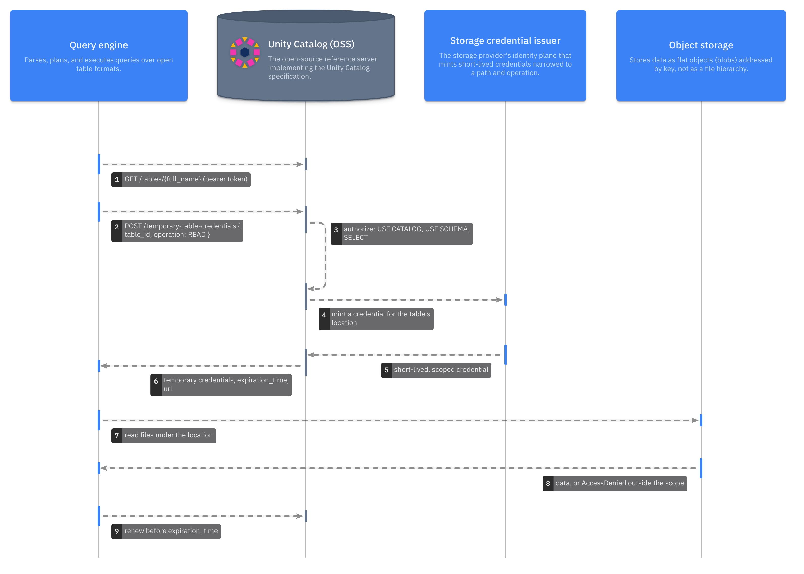

Engines read and write a lakehouse's data directly in
[object storage](model:lakehouse.objectStorage), so something has to give them
access to that storage. With *credential vending*, the
[Unity Catalog](model:unityCatalogOSS) server gives it. The server holds the
one identity that can reach the storage. A client proves who it is to the
catalog and asks for access to a single table, volume, model version, or path.
If the catalog's grants allow it, the server returns a credential that works
only for that location and that kind of access, and that expires within an
hour. This page explains how that exchange works and where its guarantees end.

## Why vend credentials instead of sharing keys

The alternative is to give every engine and user a storage key, or to keep a
bucket policy for each of them. Each key is a standing secret that can leak.
It usually reaches far more data than its holder needs. Revoking access means
rotating the key everywhere it was copied, and the catalog's grants and the
storage's permissions drift apart.

Vending moves the long-lived secret into one place, the catalog server, and
gives clients only short-lived, narrow credentials. That has three effects:

- **Clients prove identity and never hold long-lived keys.** A client
  authenticates to the catalog with its own token. The storage identity never
  leaves the server.
- **Each credential has a small blast radius.** It covers one location and one
  operation, so a leaked credential exposes one table's files for at most an
  hour.
- **Grants take effect quickly.** Every credential request passes the catalog's
  authorization check. Revoke a grant and the next request fails. The longest
  delay is the remaining lifetime of a credential already handed out. No key
  needs rotating.

The catalog makes the access decision, and the storage enforces it on every
request. Neither has to trust the client.

## The flow

A client that reads a table makes two calls to the catalog before it touches
storage. Expand the diagram and step through it:

1. **Resolve.** The client looks up the table by name with its own bearer
   token. The answer includes the table's ID and its storage location.
2. **Request.** The client asks `POST /temporary-table-credentials` for that
   table ID and an operation, `READ` or `READ_WRITE`.
3. **Authorize.** The server checks the caller's privileges. A read needs
   `USE CATALOG`, `USE SCHEMA`, and `SELECT` on the table. A write also needs
   `MODIFY`. Ownership covers both. If the check fails, no credential is minted.
4. **Mint.** The server finds the external location that contains the table's
   path and uses that location's storage credential. It asks the cloud's
   [credential issuer](model:lakehouse.credentialIssuer) for a credential
   narrowed to the table's location and the requested operation.
5. **Return.** The client receives the credential, the URL it covers, and an
   `expiration_time` in epoch milliseconds.
6. **Read.** The client reads the files straight from storage. Data never flows
   through the catalog. The storage rejects any request outside the
   credential's scope.
7. **Renew.** Before the credential expires, a long-running client asks again,
   and the server checks the grants again.

Volumes, model versions, and paths follow the same flow through their own
endpoints.

## What a credential covers

The server vends credentials through four endpoints. Each request names one
object and one operation, and the privileges it needs depend on both. A
request for anything inside a schema also needs `USE CATALOG` and `USE SCHEMA`
on its parents, or ownership of them.

| Endpoint | Operations | Privileges required |
| --- | --- | --- |
| `/temporary-table-credentials` | `READ`, `READ_WRITE` | `SELECT` to read; `SELECT` and `MODIFY` to write; or ownership |
| `/temporary-volume-credentials` | `READ_VOLUME`, `WRITE_VOLUME` | `READ VOLUME` to read; ownership to write |
| `/temporary-model-version-credentials` | `READ_MODEL_VERSION`, `READ_WRITE_MODEL_VERSION` | `EXECUTE` on the registered model to read; ownership to write |
| `/temporary-path-credentials` | `PATH_READ`, `PATH_READ_WRITE`, `PATH_CREATE_TABLE` | The privileges of the object that owns the path. For a path no object owns: `READ FILES` on the external location to read, `READ FILES` and `WRITE FILES` to write, `CREATE EXTERNAL TABLE` to create a table, or ownership |

A path request can't get around a table's grants. If the path falls inside a
table or volume, the server applies that object's privileges, as if the client
had asked for the object itself.

Engines that speak the [Delta API](../external-and-managed-tables/index.md)
get credentials from its own endpoints, with the same checks. When a client
creates a catalog-managed table, the staging response already includes a
read-write credential for the new table's location. The Iceberg REST API
returns a credential with the table's storage configuration.

## How the server mints a credential

The server never stores credentials for individual tables. It works them out
when asked. The table's storage location falls under exactly one *external
location*, which names a *storage credential*, which holds the identity the
server uses with the cloud. External locations can't overlap, so the answer is
always unique. See
[Namespaces, securables, and storage locations](../uc-basics/index.md) for how
locations and storage roots fit together.

Each cloud narrows the credential differently:

| Storage | How the credential is narrowed | What the client receives |
| --- | --- | --- |
| Amazon S3 | The server calls AWS STS `AssumeRole` on the storage role, with a session policy that allows only the requested prefix and operation. | Access key, secret key, and session token, valid for one hour |
| Azure Data Lake Storage | The server gets a user-delegation key from the storage account and signs a SAS token for the requested path. | A user-delegation SAS, valid for one hour |
| Google Cloud Storage | Google STS downscopes the server's token with a credential access boundary on the requested prefix. | An OAuth token |

Storage credentials as catalog objects exist for AWS only. Azure and GCS
vending uses server-wide `adls.*` and `gcs.*` settings in `server.properties`,
and so does S3 when no external location covers a bucket. For the AWS setup
(master role, storage roles, external IDs), see
[Configure AWS storage credentials and external locations](../../how-to/configure-aws-storage/index.md).

A `file://` location needs no keys. The server still checks the privileges, but
its answer carries only the location. That is why local examples print empty
credentials.

## Expiry and renewal

A credential expires on its own. Its response carries `expiration_time` in
epoch milliseconds. Clients should cache the credential until shortly before
then and request a new one, rather than ask again for every file. The Spark
connector does this automatically with its `renewCredential.enabled` option
(see [Configure Spark](../../how-to/configure-spark/index.md)). If you build
your own client, give its storage layer a credential callback that asks the
catalog again before expiry. obstore's credential providers, for example, cache
a credential until the `expires_at` you return.

The server can't recall a credential it has already issued. Revoking a grant
stops new credentials, but an existing one stays valid until it expires.

## Where the trust boundary sits

Vending protects data only if the catalog is the only way to reach it. These
are the places where that assumption ends:

- **Standing storage access bypasses the catalog.** Anyone who can reach the
  bucket with their own IAM role or key never asks the catalog, so its grants
  don't apply to them. Keep direct access to governed locations limited to the
  server's identity and to operators.
- **A vended credential is a bearer credential.** Storage doesn't know who it
  was vended to. Whoever holds it can use it until it expires, so treat it like
  any other secret in logs and job configuration.
- **Access is all-or-nothing per location.** A credential opens every file
  under the table's location. The catalog can't use it to hide rows or columns,
  because the client reads the files itself. Row filters and column masks need
  an engine you trust to apply them.
- **The decision is only as strong as authentication.** With authorization
  disabled, the server vends to any caller. Enable authentication and
  authorization before you point the server at real storage.
- **The server's identity is the crown jewel.** The master role, or the keys in
  `server.properties`, can reach every governed location. Protect the server
  host and its configuration accordingly.

## Further reading

- [Configure AWS storage credentials and external locations](../../how-to/configure-aws-storage/index.md)
  sets up vending on S3 and checks a vended credential.
- [Set managed storage for catalogs and schemas on S3](../../how-to/managed-storage-s3/index.md)
  puts managed tables and volumes under an external location.
- [Read files from a volume](../../tutorials/read-volume-files/index.md)
  requests a volume credential and opens storage with it.
- [External tables and catalog-managed Delta tables](../external-and-managed-tables/index.md)
  shows where credentials appear in the Delta API lifecycle.
