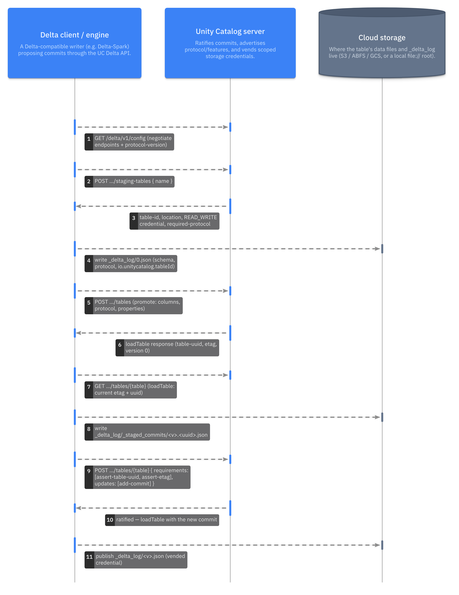

Unity Catalog knows two kinds of table. They differ in two things: who owns
the files, and who decides which version of the table is the current one. This
page explains both kinds, what the server does for a catalog-managed
[Delta](model:deltaSpec) table, and why the difference matters to every engine
that touches the table. It describes the open source server at version 0.6.0.

## Two questions decide the kind

**Who owns the files?** An *external* table points at a location that
someone else chose and controls. The catalog records the table's name, columns,
format, and location, and never moves or deletes the files. A *managed* table
lives at a location the catalog chooses, under the storage root of its schema
or catalog. The catalog creates that location, and deletes it when the table
is dropped.

**Who decides the latest version?** A Delta table is a series of numbered
commits in its `_delta_log`. For an external table, the files decide: whichever
writer manages to put commit file `N` in place first has made version `N`, and
the catalog plays no part. For a *catalog-managed* Delta table, the catalog
decides. A writer proposes commit `N`, and it becomes the table's version `N`
only once the server accepts it.

In Unity Catalog 0.6.0 the two answers go together. Managed tables are always
Delta, and a client that creates one through the Delta API, such as Spark with
Delta 4.3 or later, makes it catalog-managed. External tables never are.

| | External table | Managed (catalog-managed Delta) table |
| --- | --- | --- |
| Location | You supply it | The catalog allocates it |
| Who accepts commits | The files, first writer wins | The Unity Catalog server |
| Formats | Delta, Parquet, CSV, and others | Delta only |
| Dropping the table | Removes the catalog entry, keeps the files | Deletes the files too |
| Path-based clients | Can read and write the location | Can't load it without the catalog |
| How to create one | [Register it](../../how-to/register-external-table/index.md) | [`CREATE TABLE` without a location](../../tutorials/managed-delta-table/index.md) |

## Why a catalog should accept commits

When the files decide, the storage system has to resolve races between writers,
and every guarantee follows from that one atomic file operation. That has
worked for years, but it leaves the catalog as a bystander. The catalog can't
reject a commit that breaks a rule, can't see a commit before it lands, and
can't coordinate changes across tables.

When the catalog accepts commits, it becomes the table's source of truth. Two
writers that race for the same version get one acceptance and one rejection,
whatever the storage system offers. The catalog can require table features,
such as deletion vectors or in-commit timestamps, before a table may exist. A
reader asks the catalog for the latest version instead of listing files.

Delta records this arrangement in the table itself as the `catalogManaged`
table feature. The
[Delta protocol](https://github.com/delta-io/delta/blob/v4.3.1/PROTOCOL.md#catalog-managed-tables)
requires every client that reads or writes such a table to ask the catalog.

## The lifecycle through the Delta API

The server speaks to Delta clients through the *Delta API*, a versioned REST
interface under `/api/2.1/unity-catalog/delta/v1/`. Its
[managed-tables protocol](https://github.com/unitycatalog/unitycatalog/blob/v0.6.0/spec/protocols/ManagedTablesSpec.md)
defines each step. Expand the diagram and step through it:



The lifecycle has four parts.

1. **Negotiate.** The client asks `GET /delta/v1/config` which endpoints and
   which protocol version the server supports. Unity Catalog 0.6.0 answers with
   twelve endpoints and protocol version `1.0`.
2. **Stage.** To create a table, the client asks for a *staging table*. The
   server picks the location, issues a read-write credential for it, and states
   the Delta protocol the table must use. A 0.6.0 server answers like this:

   ```json
   {
     "table-type": "MANAGED",
     "location": "file:///tmp/uc-docs/managed/__unitystorage/catalogs/<catalog-id>/tables/<table-id>",
     "required-protocol": {
       "min-reader-version": 3,
       "min-writer-version": 7,
       "reader-features": ["catalogManaged", "v2Checkpoint", "vacuumProtocolCheck", "deletionVectors"],
       "writer-features": ["catalogManaged", "v2Checkpoint", "vacuumProtocolCheck", "deletionVectors", "inCommitTimestamp"]
     },
     "suggested-protocol": {
       "reader-features": ["columnMapping"],
       "writer-features": ["columnMapping", "domainMetadata", "rowTracking"]
     }
   }
   ```

   The response also lists the matching required and suggested table
   properties. The client writes version 0 of the Delta log at that location,
   then asks the server to turn the staging table into a real one.
3. **Commit.** For each change, the client writes the new data files and a
   commit file under `_delta_log/_staged_commits/`, named with the version and a
   random ID. It then sends one request that names the commit and the
   conditions under which to accept it, for example that the table is still the
   one it loaded. The server checks the conditions and accepts or rejects the
   commit as a whole.
4. **Load.** A reader asks the server for the table. The response includes the
   latest accepted version and the recent commits, so the reader knows exactly
   which files make up the table.

Throughout, the server hands out storage credentials scoped to the table's
location, so no client needs standing access to the whole bucket. See
[Credential vending](../credential-vending/index.md) for that trust boundary.

## What clients must support

Because the protocol lives in the table, a client that doesn't speak it can't
use the table at all, not even to read it. Unity Catalog 0.6.0 gives a
path-based client nothing to work with: delta-rs 1.6.6, pointed at a managed
table's location, stops with
`Max catalog version is required when loading a catalog-managed table`. That
refusal is deliberate. A client that only lists files could miss commits the
catalog has accepted, or write a version the catalog never approved.

So for a managed table, choose a client that goes through the catalog. At
0.6.0 these include Spark with the Unity Catalog connector and Delta 4.3 or
later, and DuckDB's `unity_catalog` extension for reads and appends. See
[Clients and engines](../../reference/clients-and-engines/index.md) for the
tested list.

An external table makes the opposite trade. Any client with access to the
storage can read and write it, including tools that have never heard of
Unity Catalog. That suits data that another system already owns. But the
catalog can't coordinate those writers, and its record of the columns can fall
out of step with the files.

## When to use which

Use a managed table when Unity Catalog should own the data. You get a location
nobody has to plan, commits that the catalog checks, and clean deletion.

Use an external table when the data already exists, when another system writes
it, or when it isn't in Delta format. Registering such a table gives it a
governed name without changing who writes it.

## Further reading

- [Create and update a catalog-managed Delta table](../../tutorials/managed-delta-table/index.md)
  walks the lifecycle above with Spark.
- [Namespaces, securables, and storage locations](../uc-basics/index.md)
  explains storage roots and how managed locations are inherited.
- The [Delta API specification](https://github.com/unitycatalog/unitycatalog/blob/v0.6.0/api/delta.yaml)
  defines every endpoint and field.
