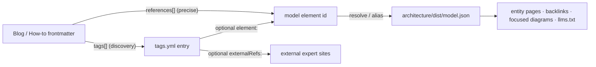

# The docs site as a model-driven information system

**Status:** design (companion to [ADR-0001](../decisions/ADR-0001-model-driven-information-system.md)).
**Scope:** cross-cutting — spans the LikeC4 model (`architecture/`), `blogs/`,
`content/`, `tools/docsnip`, and `site/`.

This document specifies the **connection mechanism** that lets the estate LikeC4
model impose structure and internal linkage on the documentation site. It is
deliberately independent of the model's *current* shape: the logical layer keeps
evolving, so what we commit to here is *how content joins the model* and *how that
join grows more correct over time* — not today's element list.

We turned `site/` from a docs+blog renderer into an **information system**: a reader
(human or agent) arriving at any page can see where the concept sits in the estate,
which specifications and implementations realize it, where the authoritative
external explanations live, how mature it is, and what else references it — without
any of that being hand-maintained per page. The model is the backbone; content links
*into* it and the model links *back out* to content.

Three framing commitments:

- **The model is evolving.** The durable deliverable is the join mechanism, not a
  commitment to today's capabilities/roles. References must tolerate rename and
  rework (see §5).
- **Specifications and how-tos are the primary anchor.** Specifications (Delta,
  Iceberg, the Iceberg REST & UC catalog specs, Parquet, the S3 API — see
  `architecture/adr/ADR-0004`) have the most stable external identities, already map
  to blog tags, and already carry `link`s to expert sites; implementations
  (DataFusion, Spark, Lakekeeper, …) are the next anchor. How-tos are where readers
  land. We start linkage there and expand into the abstract layer as it settles.
- **The index grows more correct over time.** Partial coverage is expected and
  *tracked*, never fatal (see §4). Correctness ratchets upward.

Narrative stays in `blogs/`; structural fact stays in the model
(`architecture/adr/ADR-0002`). This system is the connective tissue between them.

## 1. The join contract (hybrid)

Two vocabularies exist and must not be conflated: blog **tags** (discovery labels,
[`../../blogs/tags.yml`](../../blogs/tags.yml)) and model **element ids** (`ucSpec`,
`lakehouse.catalog`, …). The hybrid contract lets each do what it is good at.



The site reads `dist/model.json` live (via the `likec4:single-project` Vite plugin
over `architecture/model`) to drive `ui`; the only generated artifacts are
`*.llms.txt` and `examples-manifest.json`.

### 1.1 Tags gain optional structure (backward-compatible)

Today each entry in [`tags.yml`](../../blogs/tags.yml) is `tag: { description }`. We
extend it so a tag *may* additionally carry a model anchor and curated external
references. Description-only entries stay valid — this is purely additive.

```yaml
# blogs/tags.yml (extension)
unity-catalog:
  description: "Unity Catalog / data governance"
  element: ucSpec                # optional: a model.json element id (the UC spec)
  externalRefs:                  # optional: typed, curated expert links
    - { role: upstream, url: "https://www.unitycatalog.io" }
    - { role: spec,     url: "https://docs.unitycatalog.io" }
codegen:
  description: "Proto-driven / build-time code generation"
  # no element: — a legitimately folksonomy-only tag; nothing dangles
```

`externalRefs.role` vocabulary (initial): `upstream · spec · repo · paper · docs`.
When a tag has no `element:`, it remains a pure discovery label — the designed escape
hatch for the ~40% of tags with no structural counterpart.

### 1.2 Pages may declare precise references

For exact anchoring beyond coarse tags, blog drafts and `content/**` pages may add an
optional `references:` list of model element ids to frontmatter:

```yaml
# a how-to page's frontmatter
title: Read and write managed tables via the UC Delta API
diataxis: how-to
project: unitycatalog
references: [ucSpec, lakehouse.catalog]   # optional, precise, validated
```

Anchor targets may be *any* element id, but authors are guided to prefer
**specifications and implementations** (concrete, stable) over abstract
capabilities/roles while the logical layer is unsettled. See `content/README.md` for
the authoring surface (the inline `model:<id>` link and the page-level `references:`
list).

### 1.3 Worked example (specification-anchored)

A how-to about the UC Delta API tags itself `unity-catalog`. The join resolves:

```
tag unity-catalog
  └─ element: ucSpec                           (specification, stable id)
       ├─ externalRefs → unitycatalog.io, docs.unitycatalog.io   (expert sites)
       ├─ -[specifies]-> lakehouse.catalog      (capability, may churn)
       │      └─ metadata.canonicalDoc → design/catalog-plane.md
       │      └─ instanceOf (inverse) → mangrove (service, sourceRepo)
       └─ implemented by unityCatalogOSS -[implements]-> ucSpec  (implementation)
```

From one tag the page surfaces: authoritative external docs, the capability it
specifies, the canonical design doc
([`catalog-plane.md`](../../architecture/design/catalog-plane.md)), the service that
realizes it, and the reference implementation — all derived, none hand-written. The
anchor is the *specification* (`ucSpec`), the most stable identity in the estate, so
the page's linkage survives even if `lakehouse.catalog` is renamed in a model rework.

## 2. Reading the model in `site/`

The site consumes the LikeC4 estate model **live** — it does not read a generated
join artifact. `site/src/explain.ts` loads the model (via the
`likec4:single-project` Vite plugin over `architecture/model`) and joins its typed
nodes and edges to content frontmatter at build/render time. From that live join it
derives, per element:

- `kind` (capability | specification | implementation | role | service), `title`,
  `summary`, and `maturity` (from `#built` / `#designed` / `#prototype`);
- `canonicalDoc`, `sourceRepo`, and `link` / curated `externalRefs`;
- typed neighbours (in/out `specifies` / `implements` / `consumes` / `realizes` /
  `governs` / `requires` / … edges);
- **backlinks** — the inverse index of content whose effective references
  (frontmatter `references:` ∪ its tags' `element:` ids) include this element. This
  drives the "Referenced by" list on each `/explain/<id>` page.

`docsnip generate` continues to emit only `examples-manifest.json` and the
per-project `*.llms.txt`; no `graph.json` or other join file is written.

## 3. Validation & coverage (tiered gate)

Because the model churns, we do **not** hard-fail on every unresolved reference. The
gate, implemented in `docsnip validate`, is tiered:

- **Tier 1 — malformed (fails CI).** A `references:` entry or a tag `element:` that
  is syntactically invalid, or an `externalRefs` entry missing `role`/`url`. These
  are author mistakes, always fatal.
- **Tier 2 — unresolved but well-formed (coverage gap, not fatal).** A reference to
  an element id that isn't (yet) in `model.json`. This is authoring ahead of the
  model, which we want to allow while the model is reworked.
- **Tier 3 — resolved (counts toward coverage).**

The tier-2 result is **ephemeral**: `docsnip validate` prints it to stderr
(`model-reference coverage: X/Y`, `explanation coverage: X/Y`) rather than persisting
it. The live, human-facing equivalent is the "No explanation yet" gap rows in
`site/src/pages/AxisIndex.tsx`, which surface modeled-but-unreferenced elements
directly in the UI. There is no on-disk coverage record.

This makes correctness a *measurable, monotonic* property: the unresolved-reference
and unreferenced-element counts should trend to zero as the model and content
converge. Model rework is never blocked — a renamed element simply shows up as a
coverage gap until content (or an alias) catches up.

## 4. Id-stability / alias policy

Content references are only durable if element ids are. Since the model gets
reworked, we protect references with two rules:

1. **Stable slugs.** An element's id is treated as a stable public slug once it is
   referenced by content. Renames are discouraged; when unavoidable, they go through
   the alias map.
2. **Alias map.** A small map records prior/alternate ids for an element. Reference
   resolution passes through aliases before declaring a reference unresolved.

The alias map lives with the model (candidate: a `metadata { aliases "…" }` entry on
the element, or a sibling `architecture/aliases.yaml` if the DSL is awkward). The
same alias set doubles as a **disambiguation dictionary** for agents (§7): `"uc"`,
`"Unity Catalog"`, and `"the catalog"` all resolve to one canonical id.

## 5. `canonicals.yaml`

[`../../architecture/canonicals.yaml`](../../architecture/canonicals.yaml) is a small
hand-curated registry mapping capability/service → design-doc → source-repo. Much of
it overlaps `metadata.canonicalDoc` (logical elements) and `metadata.sourceRepo`
(deployment services), both already in `model.json`; a residue (per-service
`realizes` role lists, per-topology `trust`/`note`, prose notes) has no model home
today.

Because the site reads the model live rather than generating a join index, there is
**no generated registry to subsume `canonicals.yaml` into**. It is therefore
**kept** as-is: a live input to the `update-architecture` skill and a home for the
residual, non-model-expressible facts. When it drifts from the `.likec4` model
(historically it has run ahead of it), the fix is to reconcile the two — not to
delete the file. If a future rework can express every residual field as model
`metadata`/`instanceOf`, the file becomes deletable then; until then it stays.

## 6. UX surfaces (prioritized)

Ordered by value-to-effort, all deriving from the live model join (§2):

1. **Entity pages + hover cards.** Every model element resolves to a canonical
   card/page: summary, maturity badge, external expert links, canonical doc,
   neighbors (in/out edges), and "referenced by" backlinks. This is the join hub —
   served at `/explain/<id>`.
2. **Backlinks & related-by-topic.** Auto "referenced by" and "related content" (via
   shared references) — the graph-native replacement for hand-maintained see-also
   lists.
3. **Inline focused estate diagrams.** Embed estate views with the referenced node
   focused ("you are here" in the architecture).
4. **Contextual 1-hop mini-map.** A small live subgraph centered on the page's
   references, linking out to entity pages and expert sites.
5. **Dynamic/sequence views as embedded how-to explainers.** Flow views
   (`credentialVending`, a future `policyDecisionFlow`) rendered inside
   explanation/how-to pages.
6. **Deployment-topology toggle.** "How this capability is realized across
   topologies" — the differentiator static docs can't match.
7. **Maturity honesty badges.** `#built`/`#designed`/`#prototype` auto-stamp content.
8. **Glossary auto-linking.** Terms from
   [`../../architecture/glossary.md`](../../architecture/glossary.md) auto-link on
   first mention; terms that are also model elements get the full entity card.

## 7. Agent & LLM surface

The same join makes the site and the domain legible to machines. Agents are
first-class consumers — the estate is itself about agentic workloads.

- **Model-aware `llms.txt` / `llms-full.txt`.** The generator
  ([`llmstxt.py`](../../tools/docsnip/src/docsnip/llmstxt.py)) organizes the index by
  capability/specification and carries element descriptions, external expert links,
  maturity tags, and typed cross-references — the "understand the domain at large"
  artifact and the committed machine surface.
- **Structured grounding / retrieval.** The model's typed nodes and edges give agents
  *structured* retrieval, not just embedding similarity: a question resolves to a
  capability + its `canonicalDoc` + the specs and implementations that realize it +
  related content + the right LikeC4 view to cite.
- **Per-page machine context.** Each content page exposes its resolved references so
  an agent reading one page gets the typed neighborhood, not only prose.
- **Deterministic entity linking.** The alias map (§4) doubles as a disambiguation
  dictionary: `"uc"` / `"Unity Catalog"` / `"the catalog"` → one canonical id.
- **Maturity-honest answers.** Maturity tags let downstream agents avoid asserting
  unshipped behavior as fact.
- **Grounded citations & view selection.** Because nodes link to `canonicalDoc`,
  external sites, and `sourceRepo`, agents can answer with pinned citations and pick
  the correct diagram/view.
- **Queryable surface (documented future option).** Expose the model via a small API
  or MCP tool (cf. the spark-api MCP) so estate agents share one structural source of
  truth. Deferred behind the static `llms.txt`, not rejected.

## 8. Phasing

- **Name the journeys first.** Before building surfaces, name the top 2–3 reader
  journeys *and* agent journeys the system serves, so features serve them.
- **Phase 1 — specifications + how-tos.** Extend `tags.yml` with
  `element:`/`externalRefs:` for the spec/implementation-mapped tags; add
  `references:` support and the tiered validation; ship entity pages + backlinks +
  external links from the live model. This is where the model is stable and the
  payoff is immediate.
- **Phase 2 — diagrams inline.** Add focused views, mini-map, dynamic-view
  explainers, topology toggle.
- **Phase 3 — expand upward.** Expand references into capabilities/roles as the
  logical layer settles; reconcile `canonicals.yaml` against the model as it drifts.
- **Ratcheting.** At every phase the tiered gate (§3) reports where linkage is thin;
  correctness improves monotonically rather than arriving complete.

## 9. Open questions

- **Entity pages: generated skeleton or authored?** Fully derived from the model, or
  a derived skeleton authors can enrich with prose?
- **Mini-map: build-time or runtime?** Precompute 1-hop neighborhoods, or query the
  model client-side?
- **Alias map home:** element `metadata` in the DSL vs a sibling
  `architecture/aliases.yaml` — depends on how cleanly the LikeC4 DSL expresses
  multi-valued alias metadata.
- **`canonicals.yaml` residual:** can per-service `realizes` role lists and
  per-topology `trust` eventually be fully modeled (making the file deletable), or is
  a minimal residual file permanent?
